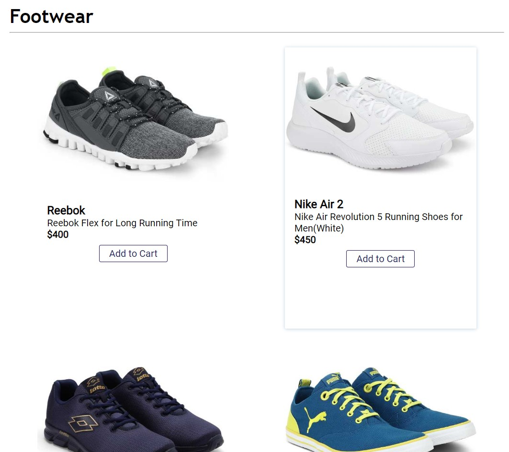

# GoCart-Ecommerce-Web-Full-Stack
E-commerce web app using Node,Express, &amp; MongoDB/Mongoose

# Features 

# Full User Authentication

### Mobile Friendly: Responsive Full Stack App
<dl>
<kbd>

</kbd>
<kbd>

</kbd>
<kbd>

</kbd>
</dl>

# Various Category of Products to choose

# Sell your items using our Node.js Backend Server

# Stripe payment gateway for secure payments

